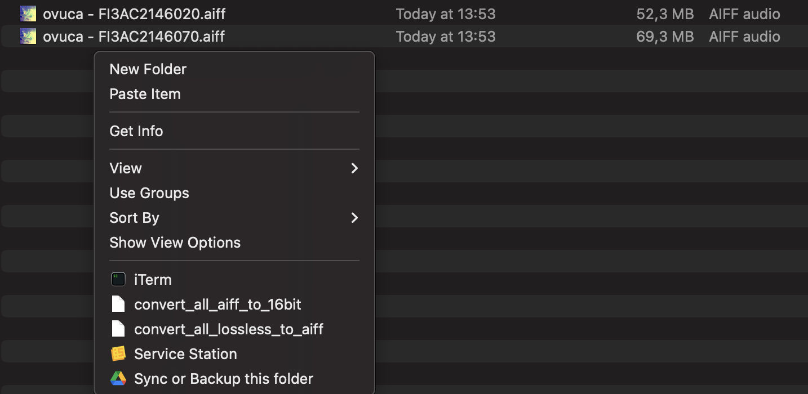

# audio-conversion-tools
This repo offers tools to convert audio files for Pioneer CDJ use. CDJs (up to 2000NXS2) only offer support for 16 / 24 bit and 44.1 / 48 kHz. With the functionality available here, you should be able to batch convert unplayable files.

## Installing
You need to install ffmpeg to run this repo, make sure the command line can run it, check `ffmpeg -h` to verify installation.

## Rekordbox:
The main functionality of this repo is scanning through your Rekordbox library and finding all unplayable files. It is possible to read the `rekordbox.db` file directly and use that to read through your library, but that contains additional configuration as the file is encrypted.

### Converting all unplayable files
The easiest way to batch convert all the files in your Rekordbox that are not playable on CDJs is by creating an xml export in Rekordbox which should contain info on all the tracks in your library. Once you have that export, you can run the following to read and convert all unplayable files:

`poetry run rekordbox-convert-unplayable-files rekordbox.xml --archive-folder /path/to/archive`

This will convert all WAV / AIFF which are not 16 / 24 bit or 44.1 / 48 kHz to a playable format. It will move the original file to the archive folder and convert that file to a playable bit depth / sample rate at the original location. The archive folder will also contain a file `converted.csv` which contains a log of all files converted. Unfortunately Rekordbox needs to reanalyze the files in order to know the new bit depth / sample rate, so simply reloading the tags on the converted files is not enough. The function creates a playlist `unplayable_files.m3u` in the archive folder which you can then load in a Rekordbox playlist (these files should already be in your collection, as these are from the old location). Once you have this Rekordbox playlist ready, you can simply select all and manually analyze tracks again. After doing that, the next time you sync with your USB, the unplayable files should be overwritten by the converted files.

Additionally, all FLACs will also be converted to AIFF, and written to `/path/to/archive/converted_flacs`. As these flacs will change filename, you need to manually add these to Rekordbox.

### Reverting the conversion
In case of errors, you can revert the conversions by running
`poetry run rekordbox-revert-conversion --archive-csv-path /path/to/archive/converted.csv`

This moves the original files in the archive folder back to its original place.

## Audio conversion tools
Next to this, the repo contains some functionality to convert audio:

- All WAV/FLACs in the current folder to AIFF
- All AIFF in the current folder to 16 bit AIFF (if the bit rate is higher than 16 bit)
- All lossless files to mp3

The script will ask you whether you want to delete the original files after conversion. This is also possible to run recursively, also converting files in subfolders. This way you can do things like converting all 24/32 bit AIFFs in your downloads folder ot 16 bit AIFF in one go.

### Adding the functions to the right click menu
A useful thing to do is to add this functionality to your right click menu, so you can right click while in a folder to convert all files inside of this folder (for example your downloads folder or a folder of an album you've just purchased). This is possible both on Windows as well as on Mac.

It is possible to add the `--recursive` flag when running the script to also convert all files in subfolders of the current folder.

#### Windows
Example behaviour:
[Here](https://www.theverge.com/23707964/windows-11-regedit-registry-menu-how-to) is a nice explanation of how to add functionality to the right click menu. This will automatically run from the correct folder. You can add the following scripts for example:
```cmd.exe /k C:/path/to/venv/python "C:/path/to/repo/scripts/convert_aiff_to_16bit.py"```

#### Mac
Example behaviour:

On mac you can use a free third party tool named [Service Station](https://servicestation.menu/). You can use the shell script templates in `scripts/sh/`, just replace the links to your Python environment and the Python script.
